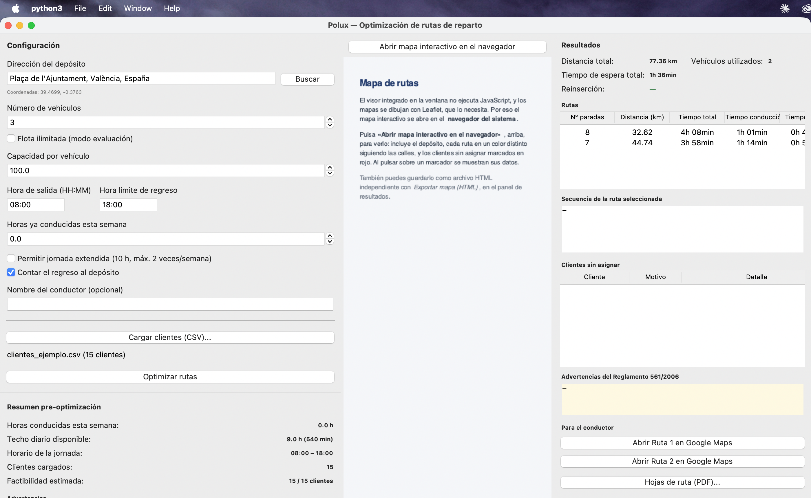

# Polux

**Polux** planifica las rutas de reparto de una flota para una jornada de
trabajo. A partir de una lista de clientes con su demanda y su ventana
horaria, reparte las visitas entre los vehículos disponibles usando
distancias reales por carretera, y respeta los límites de conducción y
descanso del **Reglamento (CE) nº 561/2006**. Para cada ruta genera una hoja
de ruta imprimible en PDF y un enlace de Google Maps que el conductor puede
abrir en el móvil.

Es un proyecto académico, desarrollado como Trabajo de Fin de Máster.



## Qué hace

- Resuelve un **VRPTW** (problema de rutas con ventanas de tiempo) con el
  algoritmo de ahorros de **Clarke-Wright**, lo mejora con **2-opt** y
  reintenta colocar los clientes descartados.
- Usa **distancias y tiempos reales por carretera** (OSRM), no líneas rectas.
- Aplica el **Reglamento 561/2006**: pausa obligatoria de 45 minutos tras
  4 h 30 de conducción continua (también en mitad de un trayecto largo),
  máximo de 9 h diarias —ampliable a 10 h—, y tope semanal de 56 h.
- Acepta clientes por **coordenadas o por dirección de texto**, que
  geocodifica con Nominatim.
- Acota la jornada con una **hora de salida y una hora límite de regreso**,
  porque el Reglamento limita las horas de conducción, no las transcurridas.
- Explica **por qué** un cliente se queda fuera: capacidad, ventana horaria,
  tiempo de conducción, falta de vehículos o dirección no encontrada.
- Exporta: **hojas de ruta en PDF** (con previsualización antes de guardar o
  imprimir), **enlaces de Google Maps** por ruta, resultados en **CSV** y el
  **mapa como HTML** independiente.

## Qué NO hace

Conviene decirlo claro para que nadie espere lo que no hay:

- **No hay aplicación móvil.** Es una aplicación de escritorio. Al conductor
  se le entrega la hoja de ruta en PDF o el enlace de Google Maps.
- **No hay seguimiento GPS ni tiempo real.** Polux planifica antes de salir;
  no sabe dónde está el vehículo ni recalcula sobre la marcha.
- **No usa el tráfico en directo.** Los tiempos de OSRM son de un modelo de
  carretera, no del tráfico de este momento.
- **El mapa interactivo se abre en el navegador**, no dentro de la ventana.
  El visor HTML integrado no ejecuta JavaScript y los mapas se dibujan con
  Leaflet, que lo necesita. La aplicación muestra un botón para abrirlo.
- **No hay base de datos ni histórico.** Cada sesión parte del CSV que se
  cargue; no se guardan clientes ni rutas anteriores.
- **La flota es homogénea**: una única capacidad para todos los vehículos.
- **Un viaje por vehículo y día.** No se contemplan segundas cargas: si la
  demanda total supera la capacidad de la flota, sobran clientes.
- **No optimiza costes ni reparte por conductor.** Minimiza distancia
  sujeta a las restricciones; no modela salarios, peajes ni combustible.

## Descargar y ejecutar en Windows

1. Ve a la [página de versiones](../../releases) y descarga el archivo
   `Polux-1.0.0.exe` de la última versión.
2. Haz doble clic. No requiere instalación ni tener Python.
3. **Windows mostrará un aviso de SmartScreen** la primera vez, porque el
   ejecutable no está firmado digitalmente (firmar requiere un certificado
   de pago). Para continuar: pulsa **«Más información»** y después
   **«Ejecutar de todas formas»**.

La aplicación guarda su caché de direcciones y las hojas de ruta que genera
en `%LOCALAPPDATA%\Polux`, nunca junto al ejecutable.

## Instalar desde el código fuente (macOS y Linux)

Requiere **Python 3.10 o superior**.

```bash
git clone <URL-DEL-REPOSITORIO>
cd polux

python3 -m venv venv
source venv/bin/activate

pip install -r requirements.txt
python3 main.py
```

En Linux puede hacer falta instalar Tk aparte, que no viene con Python:

```bash
sudo apt install python3-tk    # Debian, Ubuntu
sudo dnf install python3-tkinter  # Fedora
```

Para ejecutar los tests (no necesitan conexión a internet):

```bash
python3 -m pytest tests/ -v
```

## Primeros pasos

1. Pulsa **«Cargar clientes (CSV)...»** y elige `datos/clientes_ejemplo.csv`,
   que incluye 15 clientes ficticios repartidos por Valencia.
2. Revisa el **resumen pre-optimización**: techo de conducción disponible,
   horario de la jornada y estimación de clientes alcanzables.
3. Pulsa **«Optimizar rutas»**.
4. Pulsa **«Abrir mapa interactivo en el navegador»** para ver el resultado
   sobre el mapa, y usa los botones del panel derecho para generar las hojas
   de ruta o los enlaces de Google Maps.

Hay un segundo archivo de ejemplo, `datos/clientes_interurbano.csv`, con
ocho ciudades españolas: sirve para ver las pausas obligatorias, que en un
reparto urbano nunca llegan a activarse.

## Formato del archivo CSV

Columnas obligatorias: `id`, `nombre`, `demanda`, `hora_inicio`, `hora_fin`
y `tiempo_servicio`. La ubicación se indica de una de estas dos formas:

- `lat` y `lon`: coordenadas en grados decimales.
- `direccion`: dirección de texto, que se geocodifica al cargar el archivo.

Si una fila trae las dos, **las coordenadas tienen prioridad** y no se
geocodifica; la dirección se conserva para mostrarla en la hoja de ruta.

```csv
id,nombre,direccion,lat,lon,demanda,hora_inicio,hora_fin,tiempo_servicio
1,Panadería Central,"Calle Colón 12, Valencia",,,12,08:00,12:00,15
2,Almacén Norte,,39.4800,-0.3900,8,09:00,14:00,20
3,Cliente Ruzafa,"Carrer de Cadis 30, Valencia",39.4623,-0.3737,10,08:30,13:00,10
```

Fila a fila:

- **Cliente 1** solo da dirección: Polux la geocodifica y obtiene sus
  coordenadas. Si no la encuentra, el cliente aparece como no asignado con
  motivo `GEOCODIFICACIÓN`.
- **Cliente 2** solo da coordenadas: carga al instante, sin consultar la red.
- **Cliente 3** da las dos: se usan las coordenadas para calcular, y la
  dirección se imprime en la hoja de ruta.

Detalle de cada columna:

| Columna | Significado |
| --- | --- |
| `id` | Identificador único. El `0` está reservado al depósito. |
| `nombre` | Nombre del cliente, tal como aparecerá en la hoja de ruta. |
| `direccion` | Dirección de texto (opcional si hay `lat`/`lon`). |
| `lat`, `lon` | Coordenadas en grados decimales (opcionales si hay `direccion`). |
| `demanda` | Carga a entregar, en las mismas unidades que la capacidad del vehículo. |
| `hora_inicio`, `hora_fin` | Ventana horaria en formato `HH:MM`. |
| `tiempo_servicio` | Minutos de parada en el cliente. |

## Aviso sobre los servicios externos

Polux consulta estos servicios externos:

- **OSRM** (`router.project-osrm.org`) para las distancias y tiempos por
  carretera.
- **Nominatim** (`nominatim.openstreetmap.org`) para convertir direcciones
  en coordenadas.
- **Esri ArcGIS Online** (`server.arcgisonline.com`) para el fondo
  cartográfico del mapa. No se usan los servidores de teselas de
  OpenStreetMap porque su política de uso los reserva a su propia web y
  prohíbe que las aplicaciones tiren de ellos: hacerlo acaba en un bloqueo.

Son **instancias de demostración, sin ningún compromiso de disponibilidad**.
Funcionan bien para probar la aplicación y para un uso ocasional, pero:

- Pueden estar caídas o limitar las peticiones sin avisar. Cuando ocurre,
  Polux lo indica con un mensaje claro en lugar de fallar en silencio.
- OSRM limita la matriz de distancias a **100 ubicaciones** por consulta
  (depósito incluido), así que listas mayores necesitan trocearse.
- Nominatim exige **un máximo de una petición por segundo**, que Polux
  respeta. Cargar un CSV con muchas direcciones nuevas tarda, por tanto, del
  orden de un segundo por dirección. Las ya consultadas quedan en caché.

**Para uso continuado o con volumen hay que instalar instancias propias** de
OSRM y Nominatim y apuntar la aplicación a ellas: es un cambio de una línea
en `utils/osrm.py` (`OSRM_URL_BASE`) y otra en `utils/geocodificacion.py`
(`NOMINATIM_URL_BASE`). Usar los servidores públicos de forma intensiva es
abusar de un recurso comunitario gratuito.

## Documentación

- [`docs/MANUAL_USUARIO.docx`](docs/MANUAL_USUARIO.docx) — manual de usuario
  con capturas de pantalla: cómo preparar el CSV, configurar la jornada,
  interpretar los resultados y exportar las hojas de ruta. Se regenera con
  `python scripts/generar_manual.py`.
- [`docs/ANEXO_A_CODIGO.docx`](docs/ANEXO_A_CODIGO.docx) — anexo de la memoria
  con los cuatro fragmentos de código que concentran las decisiones
  algorítmicas, citados literalmente del código fuente. Se regenera con
  `python scripts/generar_anexo_codigo.py`.
- [`DOCUMENTACION_TECNICA.md`](DOCUMENTACION_TECNICA.md) — arquitectura,
  algoritmo, decisiones de diseño y limitaciones conocidas, en detalle.
- [`docs/CHECKLIST_PRUEBAS_WINDOWS.md`](docs/CHECKLIST_PRUEBAS_WINDOWS.md) —
  lista de comprobación para validar el ejecutable en Windows.

## Validación experimental

Polux se ha evaluado con las **56 instancias de referencia de Solomon**
(100 clientes cada una), el conjunto de pruebas estándar del VRPTW:

```bash
python3 scripts/descargar_instancias.py      # descarga las instancias
python3 scripts/ejecutar_benchmark.py datos/benchmark/solomon
python3 scripts/verificar_benchmark.py datos/benchmark/solomon
```

Los resultados quedan entre un **+10 % y un +23 % de distancia** frente a
las mejores soluciones publicadas, con un número de vehículos claramente
mayor. Es lo esperable de una heurística constructiva con mejora local
frente a las metaheurísticas que producen esos récords, y así está discutido
en la documentación técnica.

## Licencia

Distribuido bajo licencia MIT. Ver [`LICENSE`](LICENSE).
